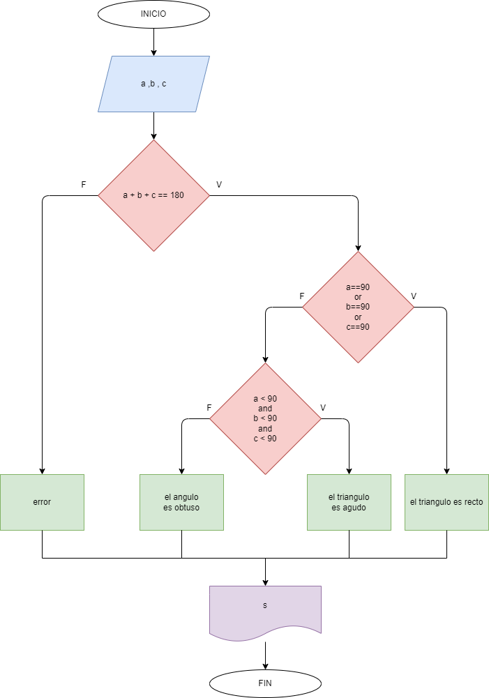

# Determinar si un triangulo es obtuso, recto o agudo.

## Diagrama de flujo

### Analisis

    Se piden tres valores para los angulos(a, b y c).
    Se comprueba si cumple que la suma de los angulos dé 180.
        *Si es falso, arroja error
        *Si es verdadero, continua el proceso.
            Se comprueba si alguno de los angulos es igual a 90.
                *Si es verdadero, el triangulo es recto.
                *Si es falso, continua el proceso.
                    Se comprueba si todos los angulos son menores que 90.
                        *Si es verdadero, el triangulo es agudo.
                        *Si es falso, el triangulo es obtuso.
                        
    
        
