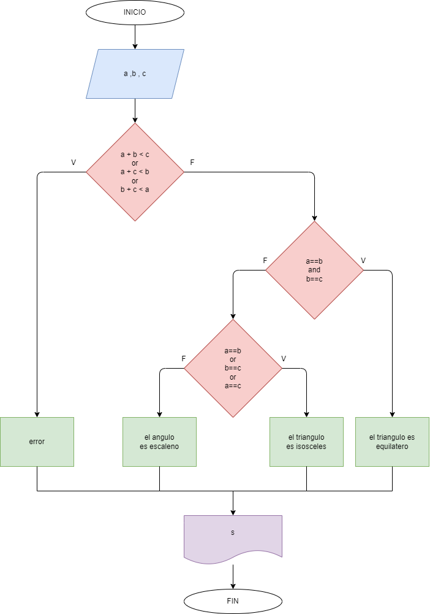

# Determinar si un triangulo es escaleno, isosceles o equilatero.

## Diagrama de flujo

### Analisis

    Se piden tres valores para los lados(a, b y c).
    Se comprueba si cumple que con esos lados se pueda construir un triangulo.
        *Si es falso, arroja error.
        *Si es verdadero, continua el proceso.
            Se comprueba si todos los lados son iguales.
                *Si es verdadero, el triangulo es equilatero.
                *Si es falso, continua el proceso.
                    Se comprueba si hay dos lados iguales.
                        *Si es verdadero, el triangulo es isosceles.
                        *Si es falso, el triangulo es escaleno.