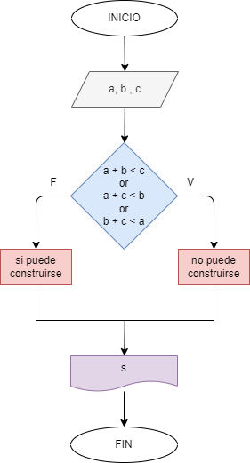

# Determinar si tres numeros pueden formar los lados de un triangulo 

## Diagrama de flujo

### Analisis

    Se piden tres valores(a, b y c).
    a + b < c or a + c < b or b + c < a
        *Si es falso, si puede construirse un triangulo con esos valores.
        *Si es verdadero, no puede construirse un triangulo con esos valores.
        
